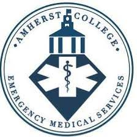

```{css, echo=FALSE}
/*Changing color scheme*/

@import url('https://fonts.googleapis.com/css2?family=Poppins:wght@300&display=swap');

body {
    font-family: 'Poppins';
}

h1, h2, h3, h4, h5, h6, legend {
  font-family: 'Poppins';
  color: #4682b4
}

#sidebar h1 {
background-color: #4682b4 !important;
}

#sidebar h2 {
background-color: #4682b4 !important;
  }

#main a {
color: #4682b4 !important;
  background-image: linear-gradient(180deg,#438a8f,#438a8f);
}

#main .navbar-nav > .active > a { 
background-color: #4682b4 !important;
  color: white !important;
}

#main li.active a, li a:hover {
background-color: #4682b4 !important;
}

code {
  color: #4682b4;
}

/*----------------- links ---------------------*/
a { 
  color: #floralwhite !important;
}

a:hover {
 background-color: #4682b4 !important;
}

/*----------LOGO above TOC---------*/
#toc {
  background-image: url("img/Mammoth-spring-sticker.gif") !important;
  background-repeat: no-repeat;
  background-size: contain;
  background-position: bottom;
}
```


```{r setup, include = FALSE, echo = FALSE}
# Set code chunk defaults 
# Consider adding `message = FALSE` option
knitr::opts_chunk$set(echo = FALSE, message = FALSE) 
                      
# Set R environment options
options(knitr.kable.NA = '')

# Load packages
library(mdsr)
library(tidyverse)
library(lubridate)
library(scales)
library(knitr)
library(dplyr)
library(stringr)
library(ggplot2)
library(data.table)
library(timetk)
library(plyr)
library(zoo)
library(clock)
library(sf)
library(leaflet)
library(colorspace)
library(RColorBrewer)
library(leaflet.extras)
library(kableExtra)
library(gridExtra)
library(grid)
library(png)
library(DT)

# Import raw data and map coordinates
file <- "data/runreport.xlsx"
map_file <- "data/BlogMapData.kml"
raw_data <- readxl::read_xlsx(file)
raw_map_data <- st_read(map_file) %>% 
  filter(Name != "booknplow farm")

# Wrangling for bar and table plot
init_summary_data <- raw_data %>%
  janitor::clean_names() %>% 
  select(-c(x6, x7, x8, was_this_call_an_especially_stressful_or_emotionally_difficult_experience_for_any_members_of_the_responding_team)) %>% 
  dplyr::rename(complaint = "chief_complaint") %>%
  mutate(abbr = substr(complaint,0,4)) %>%
  mutate(abbr = tolower(abbr)) %>%
  mutate(complaint = tolower(complaint)) %>% 
  arrange(abbr)

case_summary1 <- init_summary_data %>%
  group_by(abbr) %>%
  dplyr::summarize(N = n()) %>%
  arrange(desc(N))

case_summary <- init_summary_data %>%
  dplyr::group_by(complaint) %>%
  dplyr::summarize(N = n()) %>%
  arrange(desc(N)) %>%
  head(10) %>%
  kbl(caption = "Initial summary of case distribution") %>%
  kable_classic(full_width = F, html_font = "Cambria")

# Main wrangling
data <- raw_data %>%
  janitor::clean_names() %>% 
  select(-c(x6, x7, x8, was_this_call_an_especially_stressful_or_emotionally_difficult_experience_for_any_members_of_the_responding_team)) %>% 
  dplyr::rename(complaint = "chief_complaint") %>%
  mutate(abbr = substr(complaint,0,4)) %>%
  mutate(abbr = tolower(abbr)) %>%
  mutate(complaint = tolower(complaint)) %>% 
  arrange(abbr)%>%
  mutate(complaint = case_when(
    abbr == "acut" ~ "acute abdominal pain",
    abbr == "alle" | abbr == "hive" | abbr == "mild" | abbr == "mino" | abbr == "rash" | abbr == "skin"
    ~ "allergic reaction",
    abbr == "anap" ~ "anaphylaxsis",
    abbr == "beha" | abbr == "ment" | abbr == "pani" | abbr == "ams/" | abbr == "anxi" | abbr == "psyc" ~ "mental health",
    abbr == "burn" ~ "burn",
    abbr == "card" ~ "cardiovascular emergency",
    abbr == "ches" | abbr == "non" | abbr == "angi" ~ "chest pain",
    abbr == "dizz" ~ "dizziness",
    abbr == "envi" | abbr == "chem" | abbr == "bee " | abbr == "bug " | abbr == "heat" | abbr == "hot " | abbr == "cold" | abbr == "hydr" | abbr == "inse" | abbr == "wasp" | abbr == "tick" ~ "environmental injuries",
    abbr == "etoh" | abbr == "eval" ~ "alcohol and/or drugs",
    abbr == "eye " | abbr == "faci" | abbr == "blur" | abbr == "cott" | abbr == "ear " | abbr == "fore" | abbr == "irri" | abbr == "ocul" | abbr == "pain" ~ "eye/ear injuries",
    abbr == "fall" ~ "fall",
    abbr == "flu-" ~ "flu-like symptoms",
    abbr == "gast" | abbr == "naus" | abbr == "stom" | abbr == "emes" | abbr == "food"
    ~ "gastrointestinal",
    abbr == "head" | abbr == "migr" ~ "headache/head injury", 
    abbr == "hemo" | abbr == "lace" | abbr == "fing" ~ "laceration/hemorrhage",
    abbr == "hypo" | abbr == "diab" ~ "hypoglycemia",
    abbr == "moto" ~ "motor vehicle accident",
    abbr == "musc" | abbr == "arm " | abbr == "icep" | abbr == "leg " ~ "musculoskeletal injury",
    abbr == "over" | abbr == "took" ~ "non-alcoholic overdose",
    abbr == "resp" | abbr == "tons" | abbr == "asth" ~ "respiratory distress",
    abbr == "seiz" ~ "seizure",
    abbr == "soft" | abbr == "abra" | abbr == "spli" | abbr == "hema" | abbr == "scap" ~ "soft tissue injury",
    abbr == "stro" | abbr == "sync" ~ "stroke/syncope",
    TRUE ~ "other"
  )) %>%
  mutate(location = tolower(location)) %>%
  mutate(loc_abbr = substr(location,0,4)) %>%
  mutate(location = case_when(
    loc_abbr == "book" ~ "booknplow farm",
    loc_abbr == "chap" ~ "chapman/humphries/lincoln/rice",
    loc_abbr == "char" ~ "charles drew/cohan/lipton/garman/porter",
    loc_abbr == "conv" | loc_abbr == "noah" | loc_abbr == "morr" 
    ~ "noah webster circle",
    loc_abbr == "fres" | loc_abbr == "firs" ~ "first-year quad",
    loc_abbr == "gree" ~ "greenway dorms",
    loc_abbr == "gym/" ~ "gym/athletic fields",
    loc_abbr == "keef" ~ "keefe/beneski/mead",
    loc_abbr == "king" ~ "king/wieland",
    loc_abbr == "mars" ~ "marsh/plimpton/tyler",
    loc_abbr == "mayo" ~ "mayo-smith/seelye/hitchcock",
    loc_abbr == "merr" ~ "merrill/mcguire/seeley mudd",
    loc_abbr == "nepo" | loc_abbr == "newp" ~ "newport/seligman",
    loc_abbr == "powe" ~ "powerhouse",
    loc_abbr == "scie" ~ "science center",
    loc_abbr == "tapl" ~ "taplin/jenkins",
    loc_abbr == "vale" ~ "valentine quad"
  )) %>% 
  mutate(result = case_when(
    result == "Refusal" | result == "result" | result == "This didn't have to be a call" ~ "ACEMS care only",
    TRUE ~ "Higher level of care"
  )) %>% 
  mutate(
    ifEtOH = ifelse(complaint == "alcohol and/or drugs", 1, 0),
    time_of_call = substr(time_of_call,11,19),
    date_time = paste(date_of_call, time_of_call, sep = " ")) %>% 
  mutate(date_time = as.POSIXct(date_time)) %>% 
  filter(date_time > as.POSIXct("2000-07-01 01:00:00")) %>% 
  mutate(month = format(date_of_call, "%Y-%m")) %>%
  mutate(year = format(date_of_call, "%Y")) %>%
  mutate(week = format(date_of_call, "%Y-%M-%W")) %>%
  mutate(
    day_of_week = weekdays(as.Date(date_of_call)),
    temp_date = as.POSIXct(paste0("2000-02-02", time_of_call)),
    time_of_day = case_when(
      temp_date >= as.POSIXct("2000-02-02 00:00:00") & temp_date < as.POSIXct("2000-02-02 04:00:00") ~ "12 AM - 4 AM",
      temp_date >= as.POSIXct("2000-02-02 04:00:00") & temp_date < as.POSIXct("2000-02-02 08:00:00") ~ "4 AM - 8 AM",
      temp_date >= as.POSIXct("2000-02-02 08:00:00") & temp_date < 
as.POSIXct("2000-02-02 12:00:00") ~ "8 AM - 12 PM",
      temp_date >= as.POSIXct("2000-02-02 12:00:00") & temp_date <
as.POSIXct("2000-02-02 16:00:00") ~ "12 PM - 4 PM",
      temp_date >= as.POSIXct("2000-02-02 16:00:00") & temp_date <
as.POSIXct("2000-02-02 20:00:00") ~ "4 PM - 8 PM",
      temp_date >= as.POSIXct("2000-02-02 20:00:00") & temp_date <
as.POSIXct("2000-02-02 23:59:59") ~ "8 PM - 12 AM"
    )
  ) %>% 
  mutate(
    semester = case_when(
      month == "2016-09" | month == "2016-10" | month == "2016-11" | month == "2016-12" ~ "Fall 2016",
      month == "2017-02" | month == "2017-03" | month == "2017-04" | month == "2017-05" ~ "Spring 2017",
      month == "2017-09" | month == "2017-10" | month == "2017-11" | month == "2017-12" ~ "Fall 2017",
      month == "2018-02" | month == "2018-03" | month == "2018-04" | month == "2018-05" ~ "Spring 2018",
      month == "2018-09" | month == "2018-10" | month == "2018-11" | month == "2018-12" ~ "Fall 2018",
      month == "2019-02" | month == "2019-03" | month == "2019-04" | month == "2019-05" ~ "Spring 2019",
       month == "2019-09" | month == "2019-10" | month == "2019-11" | month == "2019-12" ~ "Fall 2019",
      month == "2020-02" | month == "2020-03" | month == "2020-04" | month == "2020-05" ~ "Spring 2020",
      month == "2021-02" | month == "2021-03" | month == "2021-04" | month == "2021-05" ~ "Spring 2021",
      month == "2021-09" | month == "2021-10" | month == "2021-11" | month == "2021-12" ~ "Fall 2021",
      month == "2022-02" | month == "2022-03" | month == "2022-04" | month == "2022-05" ~ "Spring 2022",
      month == "2022-09" | month == "2022-10" | month == "2022-11" | month == "2022-12" ~ "Fall 2022",
      month == "2023-02" | month == "2023-03" | month == "2023-04" ~ "Spring 2023",
      TRUE ~ "test"
    )
  ) %>% 
  inner_join(raw_map_data, by = c("location" = "Name"))
```

<div style= "float:right;position: relative; top: -180px; right: -20px">
```{r, fig.cap='', out.width="70%", fig.align="right", out.extra='style="float:right; padding:10px"', message=FALSE, echo = FALSE}



```
</div>
# Introduction

This project uses data from the Amherst College Emergency Medical Service (ACEMS) to explore trends in campus medical emergencies. We wanted to pick a topic which could convey some information about Amherst, hoping that a more personal topic would lead to interesting findings. The decision to use ACEMS data began with a conversation between the two of us. With one of us a senior member of ACEMS and the other an unaffiliated Amherst student, we noticed a strong disconnect in the amount of campus knowledge and awareness of ACEMS (Julius didn't even know how many members there were!). We hope that this topic will both increase knowledge of ACEMS' activities and generally reflect some trends of Amherst's campus life.

To tackle these goals, we address three central questions. First, where and when do campus emergencies typically occur? To answer, we summarize ACEMS responses, tracking the locations and types of calls which are most prevalent. Second, how can we use ACEMS data to measure COVID policy? We explore how effective restrictions were on minimizing social interaction --- using the frequency of alcohol and narcotics calls as a proxy for campus socialization. Third, what is the purview of ACEMS? When should a responder expect to escalate a call to the Amherst Fire Department (AFD)? We analyze which types of calls are typically escalated.

Discussion of our data and findings will begin with explanation of data collection and wrangling. Then we will explore our three central goals. Lastly, we conclude and discuss implications for campus life.

# Methodology

## Data Collection

For our initial data collection and preparation phase, *getting* the data set was the easiest part. As mentioned previously, Austin is a senior member of ACEMS --- and as all members are responsible for updating the emergency response meta data --- he was easily able to access the spreadsheet. After ensuring that the data were extensive and had potential for interesting interpretation, we set out on acquiring permission. Although the data omitted any personal information which could identify a patient, we wanted to be certain continuing was ethical. And luckily, after talking to Professor Correia and Austin's supervisor, we were good to go!

## Data Wrangling


<div style= "float:right;position: relative; top: -1px; right: -20px">

```{r pressure, message=FALSE, echo=FALSE}
case_summary
```
</div>

Beginning to manage the ACEMS data, we encountered many problems. Compared to our Shiny app data set, this project promised to be a greater test of our wrangling skills. The data were formatted with variables for date/time, location, complaint, and result (transferred to AFD, etc.). There were also four additional columns for additional description of a response, but those were seldom used by the ACEMS team and thus removed early. We then cleaned the date/time variable relatively easily. After removing two erroneous entries in 1890, converting the variable to type POSIXct, and creating separate columns for date, time, and day of the week --- we were satisfied. Additionally, the result variable was completed fairly easily. Then, however, the real work began.

The location and complaint columns were a mess. Names were misspelled, entries were assigned arbitrarily or with one-off markers (ie., Morris Pratt instead of the overarching Webster Circle tag) --- there was little consistency in how the data were inputted. Just for the complaint variable, we immediately noticed that 125 of the 147 total unique complaint tags had less than 10 entries. This was clearly unacceptable if we hoped to create comprehensible visualizations. 

In addition to looking out for misspellings/different variations, we also had to group together different types of complaints together. Even after correcting spelling, there were still too many unique cases to be able to make any meaningful visualizations out of. Therefore, emergencies that had a lot in common were grouped together (such as "bee sting" and "tick bite" were categorized as "environmental emergencies"). Cases like these were impossible to automate or perform with generic functions. Therefore, we painstakingly wrote case_when statements for each group. To wrangle efficiently, we created another column with the first four letter abbreviations of the target variable. Then, we grouped by abbreviation to correct for misspelling and for interpretation. This accounted for much of the inconsistency. Finally, we had finished our wrangling.

# Central Question 1: When and where are the majority of ACEMS calls?

## Introduction

We hoped that creating displays of data on location and time of campus emergencies could be particularly interesting for other students. Where do most ACEMS calls occur? We assumed a strong association between the amount of parties hosted in a dorm and the amount of calls received — but is this true? What about dorms which are further from campus? Does Humphries' House receive less calls than Morris Pratt? And for time: clearly there are more calls on the weekends, but are there more on Fridays or Saturdays? What times specifically?

## Spatial Analysis

For our first display, we decided to map the quantity of calls by location. We wanted our display to include polygons of our areas, instead of using pins. We thought this would both give a better sense of how we grouped locations and allow for a heatmap of campus. Doing so, however, required using mapping software to create a .KML file with polygons of the buildings manually selected.

With the shape file created, we used R's Leaflet package to create an interactive map of Amherst's campus.

```{r, message=FALSE, echo=FALSE}
# Leaflet wrangling
visual1data <- data %>%
  pivot_longer(location, names_to = "name", values_to = "location") %>% 
  group_by(location, geometry) %>%
  dplyr::summarize(N = n()) %>%
  st_as_sf() %>% 
  st_zm(drop = T, what = "ZM") %>%
  arrange(N)

# Define color palette for leaflet
colors <- colorBin("viridis", visual1data$N, 6, pretty = TRUE)

```

```{r, message=FALSE, echo=FALSE}
# Leaflet
leaflet(data = visual1data) %>% 
  addTiles() %>% 
  addPolygons(
    fillColor = ~colors(N)[as.numeric(factor(N))],
    stroke = FALSE,
    fillOpacity = 0.5,
    layerId = ~location
    , popup = paste0("Location: ", str_to_title(visual1data$location), "<br>"
                     , "Number of cases: ", visual1data$N)
  ) %>%
  # add legend explaining fill color
  addLegend(pal = colors, 
            values = visual1data$N,
            position = "bottomright", 
            title = "ACEMS Response Cases at Amherst College")

```

From the map, it's clear that the vast majority of ACEMS calls occur on the first-year quad. With over 150 more calls than Valentine quad, the second highest location, this is an astonishing amount. One possible explanation is that the first year quad is close to the center of campus with lots of people passing through. Another explanation is that most of the calls are from first-years who have drank too much. Usually, first-years do not know their alcoholic limit as well as upper classman and so we hypothesize that they would party then head back to their dorms, realize that they are in a bad spot, and call ACEMS.

Otherwise, though, the trends are about as we expected. The areas near typical "party dorms" are associated with greater amounts of calls. The gym and athletic fields also have relatively high numbers of calls, which makes sense given the potential for muscuoskeletal injuries.


## Temporal Analysis

We focused on time for two primary reasons. First, we were interested in short-term trends for ACEMS responses. For example: what days of the week do the most emergency calls occur? And second, we were interested in longer-term trends. How have the total amounts of calls per semester changed since 2016? Can we infer anything about campus life given those trends? How might COVID restrictions have affected the quantity of restrictions (we will address this in the third section)?

For short-term analysis, we first plotted the total amount of calls by hour of the day.

```{r initial wrangling, message=FALSE, echo=FALSE}
# Wrangling for time of day vs call frequency bar plot
visual4day <- data %>% 
  group_by(time_of_day) %>% 
  dplyr::summarize(
    N = sum(ifEtOH != 1),
    alcohol_calls = sum(ifEtOH == 1)
  ) %>% 
  pivot_longer(cols = c(N, "alcohol_calls"), names_to = "call_type", values_to = "count")

# Wrangling for day of week vs call frequency bar plot
visual4week <- data %>% 
  group_by(day_of_week) %>% 
  dplyr::summarize(
    N = sum(ifEtOH != 1),
    alcohol_calls = sum(ifEtOH == 1)
  ) %>% 
  pivot_longer(cols = c(N, "alcohol_calls"), names_to = "call_type", values_to = "count")

# Establish the correct order for time of day
visual4day$time_of_day <- factor(visual4day$time_of_day, levels = c("8 AM - 12 PM", "12 PM - 4 PM", "4 PM - 8 PM", "8 PM - 12 AM", "12 AM - 4 AM", "4 AM - 8 AM"))

# Establish the correct order for day of week
visual4week$day_of_week <- factor(visual4week$day_of_week, levels = c("Sunday", "Monday", "Tuesday", "Wednesday", "Thursday", "Friday", "Saturday"))
```

```{r}
# Time of day vs call frequency bar plot 
ggplot(data = visual4day, aes(x = time_of_day, y = count, fill = call_type)) +
  geom_bar(stat = 'identity') +
   scale_fill_manual(values = c("floralwhite", "steelblue"), name = "Type of emergency",
                    labels = c("Alcohol-related calls only", "Other calls")) +
  labs(
    title = "Number of calls throughout the day",
    x = "Time of day", 
    y = "Number of calls"
  ) +
  theme(axis.text.x = element_text(angle = 0, vjust = 0, hjust = 0.5, size = 7)) +
  theme(panel.background = element_rect(fill = "gainsboro")) + 
  geom_text(aes(label = count, group = call_type),
            position = position_stack(vjust = 0.5))
```

Unsurprisingly, ACEMS receives more calls as the night progresses, with a sharp drop in call volume by 4AM. This is consistent with the times that students would be partying and require alcohol related medical assistance, which we have demonstrated comprises the plurality of ACEMS emergencies. We can also see that the amount of emergencies involving alcohol are far greater beteen 8PM and 4AM. Building on this, we can make our first substantive — yet somewhat obvious — recommendation for the ACEMS team. ACEMS members who are on-call late at night should be readily prepared to handle cases involving intoxication and overdose. We can make similar recommendations when considering data on calls throughout the week. THe significant drop in calls between 4 AM and 8 AM is probably because that is when most parties have ended and everyone has gone to bed. The general increase in the total number of calls starting from the morning until afternoon/evening could also be explained by student activity level. As students finish classes and are out and about more often, that could lead them more prone to injury.

```{r, message=FALSE, echo=FALSE}
# Day of week vs call frequency bar plot 
ggplot(data = visual4week, aes(x = day_of_week, y = count, fill = call_type)) +
   scale_fill_manual(values = c("floralwhite", "steelblue"), name = "Type of emergency",
                    labels = c("Alcohol-related calls only", "Other calls")) +
  geom_bar(stat = 'identity') +
  labs(
    title = "Number of calls throughout the week",
    x = "Day of week",
    y = "Number of calls"
  ) +
  theme(axis.text.x = element_text(angle = 0, vjust = -0.5, hjust = 0.5, size = 8)) +
  theme(panel.background = element_rect(fill = "gainsboro")) + 
  geom_text(aes(label = count, group = call_type),
            position = position_stack(vjust = 0.5))
```
Clearly, emergency calls are significantly higher on the weekends. And, of those calls, alcohol related crises make up a greater proportion. This information may help ACEMS appropriately plan which officers to assign during weekends, prioritizing those with more experience and preparedness.

Moving on to long-term trends, we plotted the amount of calls from Fall 2016 to Spring 2023. One interesting trend is that the Fall semesters appear to be associated with higher amounts of cases. This might be explained by temperature differences. Given that Fall is generally warmer than Spring, that could lead to more active campus life and thus a greater chance of injury. This includes students who might go out partying. Another explanation could be that because the Fall semester is the start of the year, many students either haven't seen their friends for the entire summer or are making new friends which could also increase activity levels.

This graphs also supports our hypothesis in that most of the calls on the first year quad are alcohol related calls because in most semesters, the number of calls on the first year quad and the number of alcohol calls are similar in number.


```{r, message=FALSE, echo=FALSE}
# Wrangling for scatter plot
visual3data <- data %>% 
  mutate(
    month_only = substr(month, 6,7)
  ) %>% 
  filter(month_only != "01" & month_only != "06" & month_only != "07" & month_only != "08") %>% 
  filter(month != "2016-03") %>%  # We only have data on this month in Spring 2016
  group_by(semester) %>% 
  dplyr::summarize(
    all_calls = n(),
    alcohol_calls = sum(ifEtOH == 1),
    fyq_calls = sum(location == "first-year quad")
  ) %>% 
  pivot_longer(cols = c("all_calls", "alcohol_calls", "fyq_calls"), names_to = "call_type", values_to = "count")

# Establish correct order of semester
visual3data$semester <- factor(visual3data$semester, levels = c("Fall 2016", "Spring 2017", "Fall 2017", "Spring 2018", "Fall 2018", "Spring 2019", "Fall 2019", "Spring 2020", "Spring 2021", "Fall 2021", "Spring 2022", "Fall 2022", "Spring 2023"))

visual3data <- visual3data %>% 
  arrange(semester)
```


```{r, message=FALSE, echo=FALSE}
# Scatter plot
ggplot(visual3data, aes(x = semester, y = count, group = call_type, color = call_type)) +
  geom_point(size = 2) + 
  geom_line() +
  labs(
    title = "Distribution of calls by semester",
    x = "Semester",
    y = "Number of calls"
  ) +
  theme(axis.text.x = element_text(angle = 90, vjust = 0.5, hjust = 1)) +
  scale_color_manual(values = c("blue", "black", "red"), name = "Type of emergency",
                    labels = c("Alcohol calls only", "Other calls", "First-year quad only")) +
  scale_y_continuous(breaks = c(0, 20, 40, 60, 80, 100, 120, 140, 160), 
                     labels = c("0", "20", "40", "60", "80", "100", "120", "140", "160")) +
    theme(panel.background = element_rect(fill = "gainsboro"))
```


# Central Question 2: How did COVID affect ACEMS emergencies?

## Discussion

During the initial planning stages for our blog, we knew that the final version would include data related to time. We didn't know, however, precisely how we would use these data to produce interesting and pertinent findings — until Austin came up with a plan to use ACEMS emergencies to measure adherence to COVID policy.

Our plan grew from there. Given that we had already decided to measure the proportion of alcohol to non-alcohol related calls, we decided to track the volume of emergencies involving alcohol as a proxy for students' amount of socialization. Our logic is that since most students party on the weekends — and we observe significantly higher levels of alcohol/EtOH emergencies on the weekends — students generally need more care for alcohol abuse when they're more social. So, it follows that the amount of responses for intoxication can model campus' adherence to COVID restrictions.

However, the most meaningful graph that could convey any information was the scatter plot presented above. When COVID hit in Spring 2020 and students were sent back home, campus life grinned to a halt and ACEMS stopped running, thus explaining the decrease in calls. ACEMS was not active in Fall 2020 and was only restarted in Spring 2021. In Spring 2021, there was still a very low number of both total calls and alcohol calls which is expected due to the quarantine like lifestyle on campus. Surprisingly starting in Fall 2021, even with COVID policies still in place, the number of total calls and alcohol calls resumed pre-COVID levels and maintained that afterwards. 

Note, the decrease in calls for Spring 2023 is because at the time of this project, the semester is still in full swing and not all calls that would happen have been documented yet.

# Central Question 3: What level of care is requried for ACEMS emergencies?

## Introduction

The final analysis we completed was to examine what types of calls require what level of care. In ACEMS protocol, there are three possible outcomes. Either the patient can be treated with only ACEMS, or would require the hospital or the health center. For ease of visualization, we decided to group all hospital and health center visits together as "higher level of care" because the health care providers there would be paramedics/nurses/doctors which are more highly certified than ACEMS members. We hope that this information can help ACEMS prepare on their way to a call because the type of emergency is conveyed to ACEMS while they are en route to the emergency.

## Types of Emergencies

As discussed previously, we significantly consolidated the number of emergency complaint labels in our data set. The first bar graph illustrates all the newly consolidated emergencies. Most notably, alcohol calls were most common followed by musculoskeletal injuries. Outside of these two calls, most of the other types of calls have similar levels of frequency. 

Note: *environmental injuries* are injuries that are caused by nature (such as bee stings, tick bites, dog bites, etc) as well as natural chemicals (such as chemical spills). *other* consists of all the rare, more niche types of calls (such as vertigo, UTI, and gum swelling)

```{r, message=FALSE, echo=FALSE}
# Wrangling for comparison of complaint count table
final_case_summary <- data %>%
 dplyr::group_by(complaint) %>%
  dplyr::summarize(N = n()) %>%
  arrange(desc(N))

# Table of complaint count 
final_table_plot <- ggplot(final_case_summary, aes(x = reorder(complaint, -N), y = N)) + geom_bar(stat = "identity") +
  labs(
    title = "Comparison of complaint counts",
    x = "Type of emergency",
    y = "Number of cases"
  ) +
  theme(text = element_text(size = 7.5)) +
  theme(axis.text.x = element_text(angle = 90, vjust = 0.5, hjust = 1))
```
<div style= "float:right;position: relative; top: -1px; right: -20px">
```{r, message=FALSE, echo=FALSE}
final_table_plot
```
</div>
```{r, message=FALSE, echo=FALSE}
# Wrangling for level of care vs type of emergency stacked bar plot
visual2data <- data %>% 
  group_by(complaint) %>% 
  dplyr::summarize(
    N = n(),
    num_ACEMS = sum(result == "ACEMS care only"),
    num_higher = sum(result == "Higher level of care")
  ) %>% 
  mutate(
    per_ACEMS = round(((num_ACEMS) / N) * 100, digits = 2),
    per_higher = round(((num_higher) / N) * 100, digits = 2)
  ) %>% 
  pivot_longer(cols = c("per_ACEMS", "per_higher"), names_to = "type_of_care", values_to = "percentage")
```

```{r, message=FALSE, echo=FALSE}
# Level of care vs Type of Emergency stacked bar plot
ggplot(visual2data, aes(x = percentage, y = complaint, fill = type_of_care)) + 
  geom_bar(stat = "identity") +
  labs(
    title = "Care by type of emergency",
    x = "Percentage of emergencies",
    y = "Type of emergency"
  ) +
  theme(axis.text.x = element_text(angle = 0, vjust = 0.5, hjust = 1)) + 
  scale_fill_manual(values = c("steelblue", "floralwhite"), name = "Type of care",
                    labels = c("ACEMS care only", "Higher level of care")) +
  scale_x_continuous(breaks = c(0, 25, 50, 75, 100), 
                     labels = c("0%", "25%", "50%", "75%", "100%")) +
 theme(panel.background = element_rect(fill = "darkgray"))
```

In the second graph, there are six categories of calls that will require a higher level of care more than half the time. Those calls are *stroke/syncope*, *seizure*, *non-alcoholic overdose*, *chest pain*, *cardiovascular emergency*, and *anaphylaxsis*. These types of calls are often very severe and so are not surprising that they would often require higher levels of care. Most call types seem to require higher level of care about 25%-50% of the time. There are six types of calls that require advanced care less than 25% of the time. Those are *allergic reaction*, *burn*, *environmental injuries*, *headache/head injury*, *laceration/hemorrhage*, and  *musculoskeletal injury*. Most of these calls are often less severe. Although *laceration/hemorrhage* sounds very severe, most of these calls are minor bleeds and cuts. The more intense types of bleeding and cuts will require advanced care, but happen less frequently than the minor cases.

# Conclusion 

There are several key takeaways from our analysis. 

* Most calls occur on the first-year quad most likely due to first-year over intoxication
* Call count increases throughout the day, with a spike during the late night hours, and during the weekend due to increase in student activity
* Fall semesters have higher call counts than Spring semester 
* COVID only impacted call count for two semesters
* Type of care required varies greatly with type of emergency